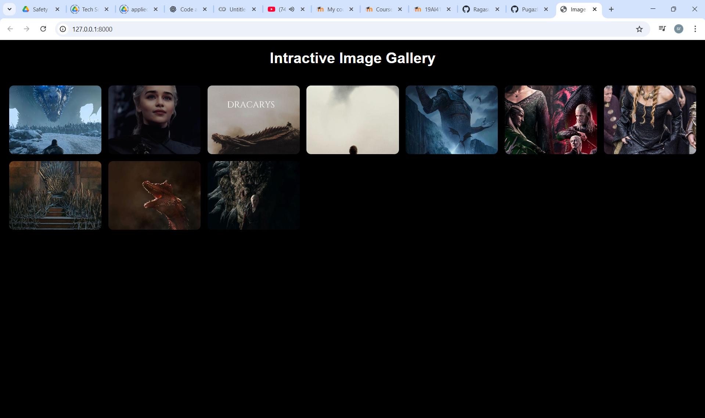
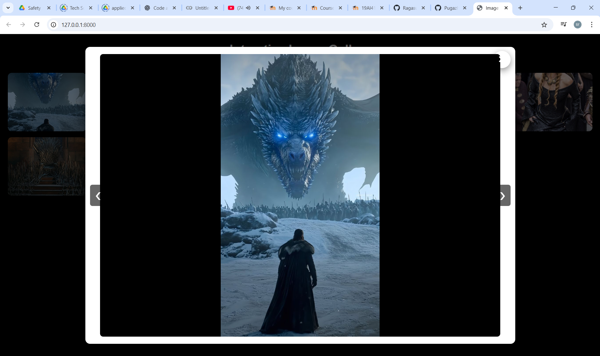
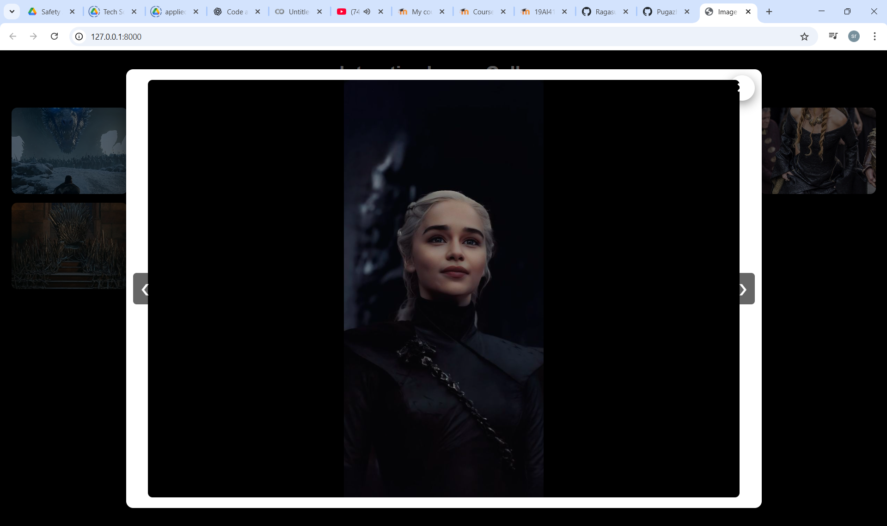
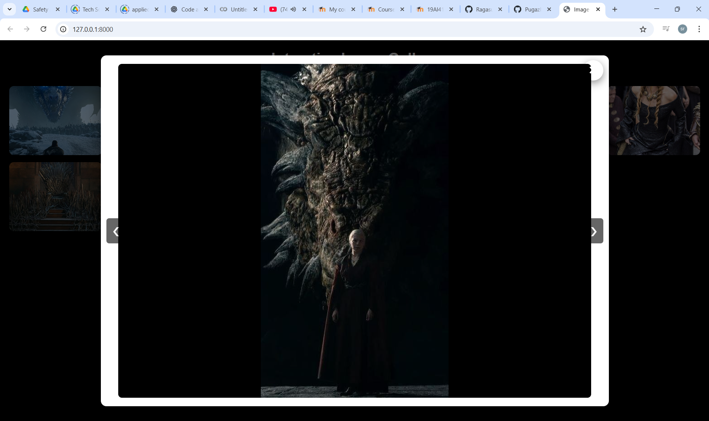
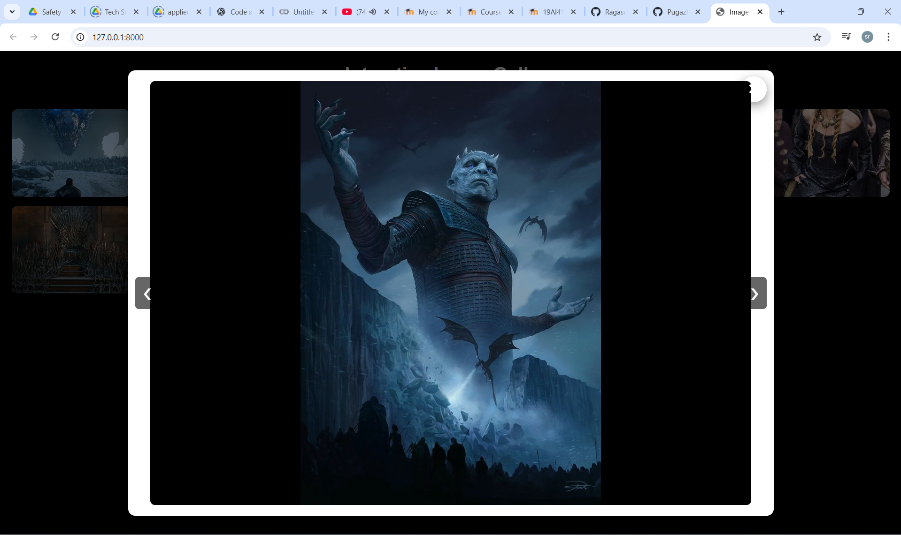
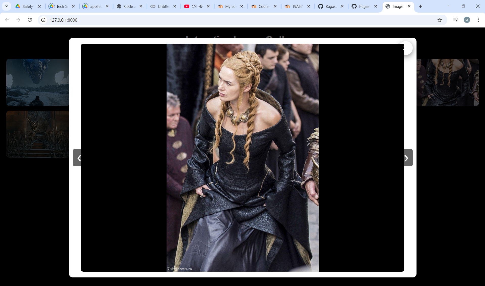
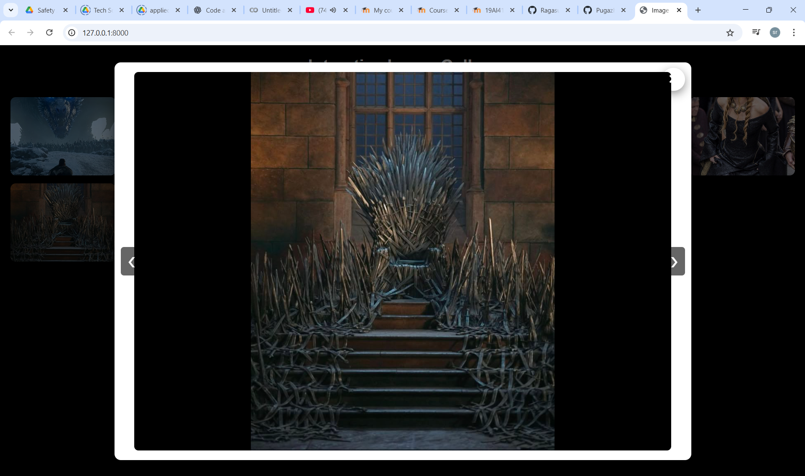

# Ex.08 Design of Interactive Image Gallery

## AIM
  To design a web application for an inteactive image gallery with minimum five images.

## DESIGN STEPS

## Step 1:

Clone the github repository and create Django admin interface

## Step 2:

Change settings.py file to allow request from all hosts.

## Step 3:

Use CSS for positioning and styling.

## Step 4:

Write JavaScript program for implementing interactivit

## Step 5:

Validate the HTML and CSS code

## Step 6:

Publish the website in the given URL.

## PROGRAM
```
galler.html



<!DOCTYPE html>
<html lang="en">
<head>
    <meta charset="UTF-8">
    <meta name="viewport" content="width=device-width, initial-scale=1.0">
    <title>Image Gallery</title>
    <link rel="stylesheet" href="">
</head>
<body>
  <h1 class="title"><center>Intractive Image Gallery</center></h1>

    <div class="gallery-container">
        
            
        
    </div>

    <div id="popup" class="popup" aria-hidden="true">
        <div class="popup-inner">
            <button id="close" class="close">&times;</button>
            <button id="prev" class="nav">&#10094;</button>
            <div class="popup-content">
                
            </div>
            <button id="next" class="nav">&#10095;</button>
        </div>
    </div>

    <script>
        const popup = document.getElementById("popup");
        const popupImg = document.getElementById("popup-img");
        const closeBtn = document.getElementById("close");
        const prevBtn = document.getElementById("prev");
        const nextBtn = document.getElementById("next");

        // base static path (ends with /)
        const staticBase = "";

        const thumbs = Array.from(document.querySelectorAll(".thumb"));
        const images = thumbs.map(t => t.dataset.filename);
        let currentIndex = 0;

        function showPopup(index) {
            currentIndex = (index + images.length) % images.length;
            popupImg.classList.remove('natural');
            popupImg.src = staticBase + 'images/' + images[currentIndex];
            popup.style.display = 'flex';
        }

        thumbs.forEach((img, idx) => {
            img.addEventListener('click', () => showPopup(idx));
        });

        closeBtn.onclick = () => popup.style.display = 'none';
        popup.onclick = (e) => { if (e.target === popup) popup.style.display = 'none'; };

        // Toggle between fit-to-screen and natural size on image click
        popupImg.addEventListener('click', (e) => {
            // prevent closing when clicking the image
            e.stopPropagation();
            popupImg.classList.toggle('natural');
        });

        // Navigation
        prevBtn.addEventListener('click', (e) => { e.stopPropagation(); showPopup(currentIndex - 1); });
        nextBtn.addEventListener('click', (e) => { e.stopPropagation(); showPopup(currentIndex + 1); });

        // Keyboard navigation
        document.addEventListener('keydown', (e) => {
            if (popup.style.display !== 'flex') return;
            if (e.key === 'ArrowLeft') showPopup(currentIndex - 1);
            if (e.key === 'ArrowRight') showPopup(currentIndex + 1);
            if (e.key === 'Escape') popup.style.display = 'none';
        });
    </script>

</body>
</html>


style.css

body {
    margin: 0;
    padding: 0;
    background: #000000; /* dark slate page background */
    font-family: Arial, sans-serif;
    color: #fff;
}

.gallery-container {
    display: grid;
    grid-template-columns: repeat(auto-fill, minmax(180px, 1fr));
    gap: 15px;
    padding: 20px;
}

.thumb {
    width: 100%;
    height: 150px;
    object-fit: cover;
    border-radius: 10px;
    cursor: pointer;
    transition: transform 0.3s;
}

.thumb:hover {
    transform: scale(1.05);
}

/* Center popup */
.popup {
    display: none;
    position: fixed;
    top: 0;
    left: 0;
    width: 100%;
    height: 100%;
    background: rgba(0,0,0,0.6); /* semi-transparent overlay so inner box stands out */
    justify-content: center;
    align-items: center;
    padding: 20px; /* keep image away from edges */
    box-sizing: border-box;
    display: flex;
}

.popup-img {
    /* Constrain popup image to viewport while preserving aspect ratio */
    width: auto;
    height: auto;
    max-width: calc(100% - 40px);
    max-height: calc(100% - 40px);
    object-fit: contain;
    background: #000; /* solid black background as requested */
}

/* Natural (native) image size: remove max constraints so user can see full resolution */
.popup-img.natural {
    max-width: none;
    max-height: none;
    width: auto;
    height: auto;
}

/* Navigation buttons */
.nav {
    position: absolute;
    top: 50%;
    transform: translateY(-50%);
    background: rgba(0,0,0,0.6);
    color: white;
    border: none;
    padding: 10px 14px;
    font-size: 28px;
    border-radius: 6px;
    cursor: pointer;
}

#prev { left: 20px; }
#next { right: 20px; }

.nav:focus { outline: none; }

#close {
    position: absolute;
    top: 30px;
    right: 40px;
    color: white;
    font-size: 40px;
    cursor: pointer;
}

.popup-inner {
    background: #fff; /* white inner box */
    color: #000;
    border-radius: 12px;
    padding: 18px;
    max-width: min(1100px, 92vw);
    max-height: 92vh;
    width: 100%;
    box-shadow: 0 12px 40px rgba(0,0,0,0.6);
    position: relative;
    box-sizing: border-box;
    display: flex;
    align-items: center;
    justify-content: center;
}

.popup-content {
    width: 100%;
    height: 100%;
    display: flex;
    align-items: center;
    justify-content: center;
    overflow: auto;
}

.popup-img {
    /* Constrain popup image to inner box while preserving aspect ratio */
    width: 100%;
    height: auto;
    max-height: calc(92vh - 36px);
    object-fit: contain;
    border-radius: 8px;
    display: block;
}

.popup-img.natural {
    max-width: none;
    max-height: none;
    width: auto;
    height: auto;
}

.nav {
    position: absolute;
    top: 50%;
    transform: translateY(-50%);
    background: rgba(0,0,0,0.6);
    color: white;
    border: none;
    padding: 10px 14px;
    font-size: 26px;
    border-radius: 6px;
    cursor: pointer;
}

#prev { left: 12px; }
#next { right: 12px; }

.nav:focus { outline: none; }

#close, .close {
    position: absolute;
    top: 10px;
    right: 12px;
    background: transparent;
    border: none;
    font-size: 34px;
    line-height: 1;
    cursor: pointer;
    color: #fff;
}

.popup-inner .close {
    color: #fff; /* keep the × visible against inner box with contrasting circle */
    position: absolute;
    top: -18px;
    right: -18px;
    background: #111;
    width: 44px;
    height: 44px;
    border-radius: 50%;
    display: flex;
    align-items: center;
    justify-content: center;
    box-shadow: 0 6px 18px rgba(0,0,0,0.45);
}


scripts.js

document.querySelectorAll(".gallery-img").forEach(img => {
    img.addEventListener("click", () => {
        document.getElementById("popup-img").src = img.src;
        document.getElementById("popup").style.display = "flex";
    });
});

document.querySelector(".close").addEventListener("click", () => {
    document.getElementById("popup").style.display = "none";
});
```

## OUTPUT













## RESULT
  The program for designing an interactive image gallery using HTML, CSS and JavaScript is executed successfully.
